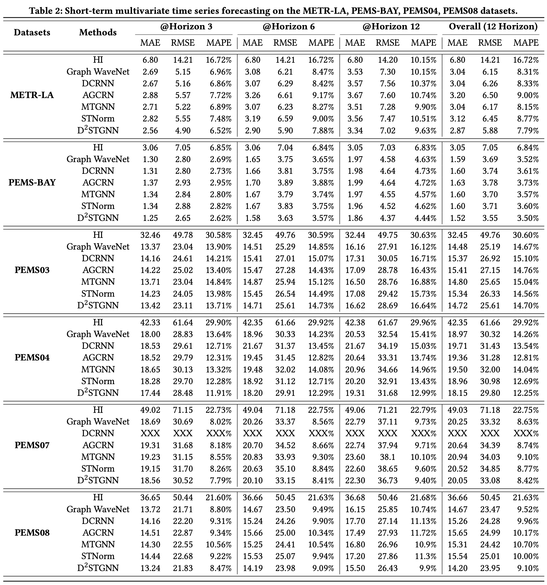

# BasicTS

[](https://github.com/cnstark/easytorch)
[](https://github.com/zezhishao/BasicTS/blob/master/LICENSE)

## 0. What is BasicTS

BasicTS (**Basic** **T**ime **S**eries) is an open-source PyTorch-based benchmark and toolbox **for time series** .
At present, it only focuses on time series forecasting, and may add time series classification, anomaly detection, etc., in the future.

BasicTS provides users with a ***unified, standard pipeline***, which provides ***reproduction and fair comparision*** of popular deep learning-based time series models to inspire new innovations.

BasicTS is developed based on [EasyTorch](https://github.com/cnstark/easytorch) [2], an easy-to-use and powerful open source neural network training framework.

If this repository helps your research or work, I hope you could give me a ⭐, and I will keep updating it. If you need more features about BasicTS (e.g. more datasets or methods) or have any questions/suggestions, please feel free to let me know~

## 1. Supported Models and Datasets

### 1.1 Short-term Time Series Forecasting

| Model\Dataset | METR-LA | PEMS-BAY | PEMS04 | PEMS08 | PEMS03 | PEMS07 | Other Datasets |
|:-------------:|:-------:|:--------:|:------:|:------:|:------:|:------:|:--------------:|
| AR            | ✅      | ✅       | ✅      | ✅     | ✅      | ✅     |                |
| VAR           | ✅      | ✅       | ✅      | ✅     | ✅      | ✅     |                |
| HI            | ✅      | ✅       | ✅      | ✅     | ✅      | ✅     |                |
| Graph WaveNet | ✅      | ✅       | ✅      | ✅     | ✅      | ✅     |                |
| DCRNN         | ✅      | ✅       | ✅      | ✅     | ✅      | ✅     |                |
| STGCN         | ✅      | ✅       | ✅      | ✅     | ✅      | ✅     |                |
| StemGNN       | ✅      | ✅       | ✅      | ✅     | ✅      | ✅     |                |
| MTGNN         | ✅      | ✅       | ✅      | ✅     | ✅      | ✅     |                |
| GTS           | ✅      | ✅       | ✅      | ✅     | ✅      | ✅     |                |
| DGCRN         | ✅      | ✅       | ✅      | ✅     | ✅      | ✅     |                |
| GMAN          | ✅      | ✅       | ✅      | ✅     | ✅      | ✅     |                |
| AGCRN         | ✅      | ✅       | ✅      | ✅     | ✅      | ✅     |                |
| STNorm        | ✅      | ✅       | ✅      | ✅     | ✅      | ✅     |                |
| STID          | ✅      | ✅       | ✅      | ✅     | ✅      | ✅     |                |
| D2STGNN       | ✅      | ✅       | ✅      | ✅     | ✅      | ✅     |                |
| Other Models  |         |         |         |        |        |        |                |

Although we have tried our best to tune the hyperparameters in `basicts/options` for every model and every dataset, there is no guarantee that they are optimal.
Thus, any PRs for better hyper-parameters are welcomed to make BasicTS fairer.

### 1.2 Long-term Time Series Forecasting

🕐

## 2. Installing Dependencies

We recommend that you install all dependencies by:

```shell
pip install -r requirements.txt
```

## 3. Codebase Designs and Conventions

🕐

## 4. Usage

`git clone https://github.com/zezhishao/BasicTS.git`

### 4.1 Data Preparation and Preprocessing

#### 4.1.1 Data Preparation

You can download the raw datasets at [Google Drive](https://drive.google.com/drive/folders/14EJVODCU48fGK0FkyeVom_9lETh80Yjp) or [Baidu Yun](https://pan.baidu.com/s/18qonT9l1_NbvyAgpD4381g)(password: 0lrk), and unzip them to `datasets/raw_data/`.

#### 4.1.2 Data Preprocessing

```bash
cd /path/to/project
python scripts/data_preparation/$DATASET_NAME/generate_training_data.py
```

Replace `$DATASET_NAME` with one of `METR-LA`, `PEMS-BAY`, `PEMS03`, `PEMS04`, `PEMS07`, `PEMS08`, or any other supported dataset.

The processed data will be placed in `datasets/$DATASET_NAME`.

Details of preprocessing can be found in `docs/DataPreparation_CN.md`~(Chinese).

### 4.2 Run a Time Series Forecasting Model

We recommend running a time series model with the following command:

```bash
cd /path/to/project
easytrain -c basicts/options/$METHOD_NAME/$METHOD_NAME_$DATASET_NAME.py --gpus '0'
```

Replace the `$METHOD_NAME` and `$DATASET_NAME` with any supported method and dataset. For example,

```bash
easytrain -c basicts/options/GraphWaveNet/GraphWaveNet_METR-LA.py --gpus '0'
```

If you need to debug, you could run the `basicts/run.py` file. 

### 4.3 Train a Custom Model

🕐

## 5. Detailed Docs

- data preparation: [data_preparation_CN.md](docs/DataFormat_CN.md)

🕐

## 6. Main Results



## 7. TODO

- [ ] : add the result of STID.
- [ ] : revise the data preprocessing of PEMS07, which only contains weekdays.
- [ ] : Add detailed documentation and a demo about data preprocessing.
- [ ] : Add more multivariate time series datasets: Traffic, Electricity, Exchange-Rate, ETTh1, ETTh2, ETTm1, Weather, Solar-Energy.
- [ ] : Different from the existing traffic datasets (PEMS0X, PEMS-BAY, METR-LA), these datasets have multiple usages in the existing datasets, and the baselines that need to be compared in different contexts are different. Therefore, it is necessary to add statistics for all datasets and describe their typical settings case by case.
- [ ] : Add statistical information of these dataset, and descibe their typical settings.
- [ ] : Support models like ASTGCN, ASTGNN, which take multi-periodicities data as input.
- [ ] : Add detailed docs about 4.2, e.g., the usage of gpu.
- [ ] : Update D2STGNN arch.
- [ ] : 模块化train_iters, val_iters, and test_iters中的过程。否则就会像GTS一样, 一旦模型有一点特殊 (例如多一个返回和不同的loss), 就必须重写整个train_iters, val_iters, and test_iters。

## References

[1] Yuhao Wang. EasyTorch. <https://github.com/cnstark/easytorch>, 2020.
