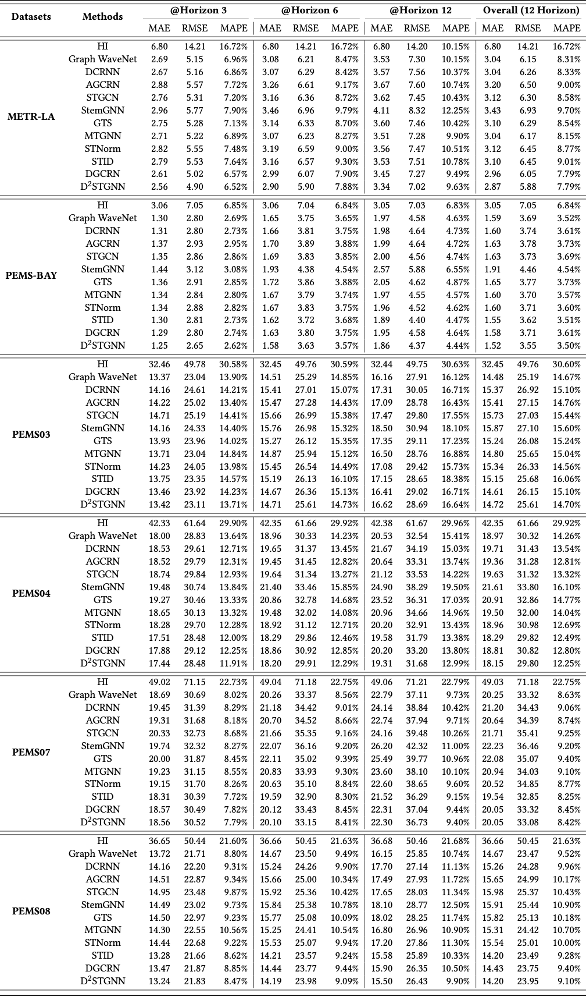

<div align="center">
  
  <!-- <h1><b> BasicTS </b></h1> -->
  <!-- <h2><b> BasicTS </b></h2> -->
  <h3><b> A Standard and Fair Time Series Forecasting Benchmark and Toolkit. </b></h3>
</div>

---

<div align="center">

[](https://github.com/cnstark/easytorch)
[](https://github.com/zezhishao/BasicTS/blob/master/LICENSE)
[](https://pytorch.org/)
[](https://github.com/zezhishao/BasicTS/blob/master/.github/workflows/pylint.yml)

</div>

BasicTS (**Basic** **T**ime **S**eries) is a PyTorch-based benchmark and toolbox for **time series forecasting** (TSF).

On the one hand, BasicTS utilizes a ***unified and standard pipeline*** to give a ***fair and exhaustive*** reproduction and comparison of popular deep learning-based models. 

On the other hand, BasicTS provides users with ***easy-to-use and extensible interfaces*** to facilitate the quick design and evaluation of new models. At a minimum, users only need to define the model architecture.

## ✨ Highlighted Features

BasicTS is developed based on [EasyTorch](https://github.com/cnstark/easytorch)[1], an easy-to-use and powerful open-source neural network training framework.

### 😼 Fair Performance Review

- 🛡**Rich Datasets**. BasicTS supports 14 datasets, *e.g.*, METR-LA, PeMS-Bay, PeMS04, ETT, Electricity, Exchange Rate, and Weather. More datasets will be added in the future.

- ⚔️**Rich Baselines**. BasicTS has a wealth of built-in spatial-temporal forecasting models (*e.g.*, Spatial-Temporal GNNs) and long time-series forecasting models (*e.g.*, Transformer-based models). 

Users can compare the performance of these models on arbitrary datasets fairly and exhaustively.

### 👨‍💻 Developing with BasicTS

- 💻**Minimum Code**. Users only need to implement key codes such as model architecture and data pre/post-processing to build their own deep learning projects.

- 🔧**Everything Based on Config**. Users can control all the details of the pipeline through a config file, such as the hyperparameter of dataloaders, optimization, and other tricks (*e.g.*, curriculum learning). 

- 🔦**Support All Devices**. BasicTS supports CPU, GPU and GPU distributed training (both single node multiple GPUs and multiple nodes) thanks to using EasyTorch as the backend. Users can use it by setting parameters without modifying any code.

- 📃**Save Training Log**. Support `logging` log system and `Tensorboard`, and encapsulate it as a unified interface, users can save customized training logs by calling simple interfaces.

## ✨ Built-in Datasets and Baselines

### 🛡 Datasets

- METR-LA, PeMS-Bay, PeMS03, PeMS04, PeMS07, PeMS08
- ETTh1, ETTh2, ETTm1, ETTm2, Electricity, Exchange Rate, Weather, Beijing Air Quality

### ⚔️ Baselines

- DCRNN, Graph WaveNet, MTGNN, STID, D2STGNN, STEP, DGCRN, DGCRN, STNorm, AGCRN, GTS, StemGNN, MegaCRN, STGCN
- Informer, Autoformer, FEDformer, Pyraformer, DLinear, NLinear, Triformer, Crossformer

## 💿 Dependencies

### OS

We recommend using BasicTS on Linux systems (*e.g.* Ubuntu and CentOS). 
Other systems (*e.g.*, Windows and macOS) have not been tested.

### Python

Python >= 3.6 (recommended >= 3.9).

[Miniconda](https://docs.conda.io/en/latest/miniconda.html) or [Anaconda](https://www.anaconda.com/) are recommended to create a virtual python environment.

### Other Dependencies

BasicTS is built based on PyTorch and [EasyTorch](https://github.com/cnstark/easytorch).
You can install PyTorch following the instruction in [PyTorch](https://pytorch.org/get-started/locally/). For example:

```bash
pip install torch==1.10.0+cu111 torchvision==0.11.0+cu111 torchaudio==0.10.0 -f https://download.pytorch.org/whl/torch_stable.html
```

After ensuring that PyTorch is installed correctly, you can install other dependencies via:

```bash
pip install -r requirements.txt
```

### Warning

BasicTS is built on PyTorch 1.9.1 or 1.10.0, while other versions have not been tested.


## 🎯 Getting Started of Developing with BasicTS

### Preparing Data

- **Clone BasicTS**

    ```bash
    cd /path/to/your/project
    git clone https://github.com/zezhishao/BasicTS.git
    ```

- **Download Raw Data**

    You can download all the raw datasets at [Google Drive](https://drive.google.com/drive/folders/14EJVODCU48fGK0FkyeVom_9lETh80Yjp) or [Baidu Yun](https://pan.baidu.com/s/10gOPtlC9M4BEjx89VD1Vbw)(password: 6v0a), and unzip them to `datasets/raw_data/`.

- **Pre-process Data**

    ```bash
    cd /path/to/your/project
    python scripts/data_preparation/${DATASET_NAME}/generate_training_data.py
    ```

    Replace `${DATASET_NAME}` with one of `METR-LA`, `PEMS-BAY`, `PEMS03`, `PEMS04`, `PEMS07`, `PEMS08`, or any other supported dataset. The processed data will be placed in `datasets/${DATASET_NAME}`.

    Or you can pre-process all datasets by.

    ```bash
    cd /path/to/your/project
    bash scripts/data_preparation/all.sh
    ```

### 3 Steps to Evaluate Your Model

- **Define Your Model Architecture**

    The `forward` function needs to follow the conventions of BasicTS. You can find an example of the Multi-Layer Perceptron (`MLP`) model in [examples/MLP/mlp_arch.py](examples/MLP/mlp_arch.py)

- **Define Your Runner for Your Model** (Optional)

    BasicTS provides a unified and standard pipeline in `basicts.runner.BaseTimeSeriesForecastingRunner`.
    Nevertheless, you still need to define the specific forward process (the `forward` function in the **runner**).
    Fortunately, BasicTS also provides such an implementation in `basicts.runner.SimpleTimeSeriesForecastingRunner`, which can cover most of the situations.
    [The runner](examples/MLP/mlp_runner.py) for the `MLP` model can also use this built-in runner.
    You can also find more runners in `basicts.runners.runner_zoo` to learn more about the runner design.

- **Configure your Configuration File**

    You can configure all the details of the pipeline and hyperparameters in a configuration file, *i.e.*, **everything is based on config**.
    The configuration file is a `.py` file, in which you can import your model and runner and set all the options. BasicTS uses `EasyDict` to serve as a parameter container, which is extensible and flexible to use.
    An example of the configuration file for the `MLP` model on the `METR-LA` dataset can be found in [examples/MLP/MLP_METR-LA.py](examples/MLP/MLP_METR-LA.py)

### Run It!

An example of a start script can be found in [examples/run.py](examples/run.py).
You can run your model by the following command:

```bash
python examples/run.py -c /path/to/your/config/file.py --gpus '0'
```


## 📌 Examples

### Reproducing Built-in Models

BasicTS provides a wealth of built-in models. You can find all the built-in models and their corresponding runners in [`basicts/archs/arch_zoo`](basicts/archs/arch_zoo/) and [`basicts/runners/runner_zoo`](basicts/runners/runner_zoo/), respectively. You can reproduce these models by running the following command:

```bash
python examples/run.py -c examples/${MODEL_NAME}/${MODEL_NAME}_${DATASET_NAME}.py --gpus '0'
```

Replace `${DATASET_NAME}` and `${MODEL_NAME}` with any supported models and datasets. For example, you can run Graph WaveNet on METR-LA dataset by:

```bash
python examples/run.py -c examples/GWNet/GWNet_METR-LA.py --gpus '0'
```

### Customized Your Own Model

- [Multi-Layer Perceptron (MLP)](examples/MLP)
- More...


## 📉 Main Results

### Spatial-Temporal Forecasting



### Long Time- Series Forecasting (⌛️ TBD)


## 🔗 Acknowledgement

BasicTS is developed based on [EasyTorch](https://github.com/cnstark/easytorch)[1], an easy-to-use and powerful open-source neural network training framework.


## 📜 References

- [1] Yuhao Wang. EasyTorch. <https://github.com/cnstark/easytorch>, 2020.
