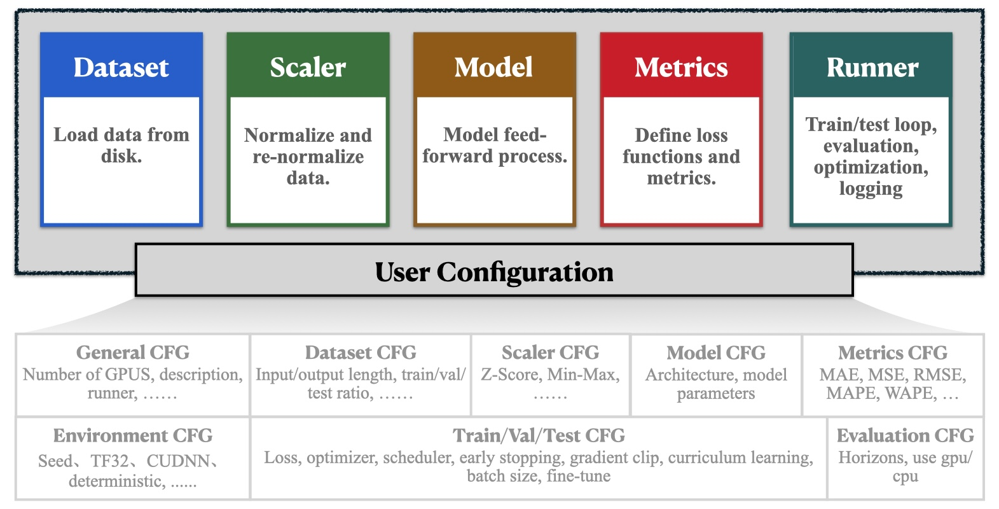

# 🎉 快速上手

欢迎使用 BasicTS 教程！本指南将带您逐步完成使用 BasicTS 1.0 训练和评估模型的过程。

在深入之前，我们先简单介绍一下 BasicTS。

***什么是 BasicTS？***

> [!IMPORTANT]  
> BasicTS 是一个专为时间序列分析设计的强大且灵活的工具。无论您是该领域的新手，还是经验丰富的专业人士，BasicTS 都能为您提供可靠的支持。使用 BasicTS，您可以轻松构建、训练和评估时间序列预测模型，还能比较各种模型的性能，找到最佳解决方案。我们已经集成了超过30种算法和20个数据集，并在持续添加更多内容。

***谁应该使用 BasicTS？***

> [!IMPORTANT]  
> BasicTS 非常适合初学者和专家使用。对于想要进入时间序列分析领域的初学者来说，BasicTS 能帮助你快速掌握基本流程并构建自己的分析模型。对于专家来说，BasicTS 提供了一个强大的平台，用于进行严格的模型比较，确保精准的研究与开发。

***核心功能***

> [!IMPORTANT]  
> BasicTS 有两个关键特性：**公平性** 和 **可扩展性**。
> **公平性**：所有模型都在相同条件下训练和评估，消除了由外部因素引入的偏差，确保了可靠的比较。
> **可扩展性**：BasicTS 具有高度的可扩展性，允许根据需要自定义数据集、模型结构和评估指标。在1.0版本中，BasicTS的扩展性得到了显著提升，您可以根据自己的需求轻松定制自己的模型和数据集。

现在，让我们开始探索如何通过 BasicTS 实现您的时间序列分析项目吧！

## 📦 安装 BasicTS

我们建议在 Linux 系统（如 Ubuntu 或 CentOS）上，在 Python 3.8 或更高版本上安装 BasicTS：

```bash
pip install basicts
```

我们推荐使用 [Miniconda](https://docs.conda.io/en/latest/miniconda.html) 或 [Anaconda](https://www.anaconda.com/) 来创建虚拟 Python 环境。

## 🔧 安装依赖项

### PyTorch

BasicTS 对 PyTorch 版本非常灵活。您可以根据 Python 版本[安装 PyTorch](https://pytorch.org/get-started/previous-versions/)。我们建议使用 `pip` 进行安装。

### 示例设置

#### 示例 1：Python 3.11 + PyTorch 2.5.1 + CUDA 12.4 (推荐)

```bash
# 安装 Python
conda create -n BasicTS python=3.11
conda activate BasicTS
# 安装 PyTorch
pip install torch==2.5.1 torchvision==0.20.1 torchaudio==2.5.1 --index-url https://download.pytorch.org/whl/cu124
```

#### 示例 2：Python 3.9 + PyTorch 1.10.0 + CUDA 11.1

```bash
# 安装 Python
conda create -n BasicTS python=3.9
conda activate BasicTS
# 安装 PyTorch
pip install torch==1.10.0+cu111 torchvision==0.11.0+cu111 torchaudio==0.10.0 -f https://download.pytorch.org/whl/torch_stable.html
```

## 🔍 下载数据集

请先从 [Google Drive](https://drive.google.com/file/d/1m8jh1z4VNMgQ49DRwywyvYYgs3G5WBsB/view?usp=sharing) or [百度网盘](https://pan.baidu.com/s/1UcZCCKPCeS7mHSnCO4-COA?pwd=j9ev) 下载 `datasets.zip` 文件。将文件解压到 `datasets/` 目录：

```bash
cd /path/to/YourProject # not BasicTS/basicts
unzip /path/to/datasets.zip -d datasets/
```

这些数据集已预处理完毕，可以直接使用。

> [!NOTE]  
> `data.dat` 文件是以 `numpy.memmap` 格式存储的数组，包含原始时间序列数据，形状为 [L, N, C]，其中 L 是时间步数，N 是时间序列数，C 是特征数。
> 
> `desc.json` 文件是一个字典，存储了数据集的元数据，包括数据集名称、领域、频率、特征描述、常规设置和缺失值。
> 
> 其他文件是可选的，可能包含附加信息，如表示时间序列间预定义图结构的 `adj_mx.pkl`。

> [!NOTE]  
> 如果您对预处理步骤感兴趣，可以参考[预处理脚本](../scripts/data_preparation) 和 `raw_data.zip`。

## 🎯 快速教程：三句代码训练并评估您的模型

```python
# train.py

from basicts.models.DLinear import DLinear, DLinearConfig
from basicts.configs import BasicTSForecastingConfig
from basicts import BasicTSLauncher

def main():

    # 1. 配置模型
    model_config = DLinearConfig(input_len=336, output_len=336)

    # 2. 配置任务
    cfg = BasicTSForecastingConfig(
        model=DLinear,
        model_config=model_config,
        dataset_name="ETTh1",
        gpus="0",
        ...
    )

    # 3.启动训练
    BasicTSLauncher.launch_training(cfg)

```

### 第一步：配置您的模型

BasicTS在`basicts.models`中提供了大量常用模型，您可以直接使用。BasicTS使用配置类来配置模型，每个配置类包含了对构造模型需要的每个参数的详细描述。例如，DLinear模型的配置类为 `DLinearConfig`。您可以在 [dinear_config.py](../basicts/models/config/dlinear_config.py) 中找到`DLinearConfig`类。

如果您想要使用自己的模型，则需要遵循 BasicTS 的规范，详情请见🧠 [深入了解模型设计并构建自定义模型](./model_design_cn.md)。

### 第二步：配置您的任务

BasicTS 支持多种时间序列任务，包括预测、插补、分类等。任务配置类是 BasicTS的核心，关于 BasicTS 任务的一切信息都囊括在了任务配置类中，几乎全部配置项都有常用的默认值，您只需配置关键的参数（1️⃣模型，2️⃣数据集），并修改少量配置（如batch size，学习率等），就能运行代码。

> [!NOTE]  
> 您可以在 [basicts/configs](../basicts/configs) 中找到每个 BasicTS 任务的配置类 （例如，预测任务的配置类为`BasicTSForecastingConfig`），及其每个参数的含义与配置方法。

进一步，在 BasicTS 的配置类中，您还可以指定回调（callbacks）和任务流（taskflow）用于在训练过程中执行额外的操作（如课程学习）和自定义数据处理流程。关于BasicTS配置类的进阶用法，请见📜 [解析配置类设计与进阶配置](./config_design_cn.md)。

### 第三步：启动训练

`BasicTSLauncher.launch_training` 是训练的入口点，调用该方法并传入任务配置即可启动训练。

> [!NOTE]  
> 需要注意的是，在DDP模式下，`BasicTSLauncher.launch_training` 需要被包裹在`if __name__ == '__main__':`中，以确保每个进程都能正确初始化模型和数据集。

## 🥳 运行它！

在您项目的目录下，运行以下命令即可启动训练：
```bash
python train.py
```
在训练中，BasicTS会默认将训练好的模型保存到 `checkpoints/` 目录下，并在训练完成后执行评估（可以通过配置更改），您也可以选择将评估指标和结果保存到 `checkpoints/` 目录下。

您可以在[示例](../examples)目录中找到更多可运行的实例。

## 如何评估您的模型

当然，您也可以在训练结束后手动评估模型：`BasicTSLauncher.launch_evaluation` 是评估的入口点，您可以通过执行下面的Python代码来评估您的模型。

```python
BasicTSLauncher.launch_evaluation(cfg, "checkpoints/your_checkpoint.pt")
```

## 🧑‍💻 进一步探索

本教程为您提供了 BasicTS 的基础知识，但还有更多内容等待您探索。在深入其他主题之前，我们先更详细地了解 BasicTS 的结构：

<div align="center">
  
</div>

BasicTS 的核心组件包括 `Dataset`、`Scaler`、`Model`、`Metrics`、`Runner` 和 `Config`。

以下是一些高级主题和附加功能，帮助您充分利用 BasicTS：


- **🎉 [快速上手](./getting_started_cn.md)**
- **💡 [了解 BasicTS 的设计理念](./overall_design_cn.md)**
- **📦 [探索数据集设计并自定义数据集](./dataset_design_cn.md)**
- **🛠️ [了解数据缩放器设计并创建自定义缩放器](./scaler_design_cn.md)**
- **🧠 [深入了解模型设计并构建自定义模型](./model_design_cn.md)**
- **📉 [了解评估指标设计并开发自定义损失函数与评估指标](./metrics_design_cn.md)**
- **🏃‍♂️ [掌握执行器设计并创建自定义执行器](runner_and_pipeline_cn.md)**
- **📜 [解析配置类设计与进阶配置](./config_design_cn.md)**
- **🎯 [探索使用BasicTS进行时间序列分类](./time_series_classification_cn.md)**
- **🔍 [探索多种基线模型](../baselines/)**
