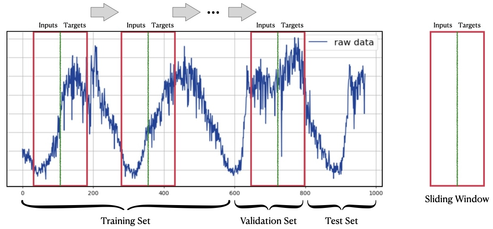

# 📦 Dataset Design

## ⏬ Data Download

To get started with the datasets, download the `all_data.zip` file from either [Google Drive](https://drive.google.com/drive/folders/14EJVODCU48fGK0FkyeVom_9lETh80Yjp?usp=sharing) or [Baidu Netdisk](https://pan.baidu.com/s/1shA2scuMdZHlx6pj35Dl7A?pwd=s2xe). After downloading, unzip the files into the `datasets/` directory:

```bash
cd /path/to/BasicTS
unzip /path/to/all_data.zip -d datasets/
mv datasets/all_data/* datasets/
rmdir datasets/all_data
```

These datasets are preprocessed and ready for immediate use.

## 💿 Data Format

Each dataset contains at least two essential files: `data.dat` and `desc.json`:

- **`data.dat`**: This file stores the raw time series data in `numpy.memmap` format with a shape of [L, N, C].
    - **L**: Number of time steps. Typically, the training, validation, and test sets are split along this dimension.
    - **N**: Number of time series, also referred to as the number of nodes.
    - **C**: Number of features. Usually, this includes [target feature, time of day, day of week, day of month, day of year], with the target feature being mandatory and the others optional.
  
- **`desc.json`**: This file contains metadata about the dataset, including:
    - Dataset name
    - Domain of the dataset
    - Shape of the data
    - Number of time slices
    - Number of nodes (i.e., the number of time series)
    - Feature descriptions
    - Presence of prior graph structures (if any)
    - Regular settings:
        - Input and output lengths
        - Ratios for training, validation, and test sets
        - Whether normalization is applied individually to each channel (i.e., time series)
        - Whether to re-normalize during evaluation
        - Evaluation metrics
        - Handling of outliers

## 🧑‍💻 Dataset Class Design

<div align="center">
  
</div>

In time series forecasting, datasets are typically generated from raw time series data using a sliding window approach. As illustrated above, the raw time series is split into training, validation, and test sets along the time dimension, and samples are generated using a sliding window of size `inputs + targets`. Most datasets adhere to this structure.

BasicTS provides a built-in `Dataset` class called [`TimeSeriesForecastingDataset`](../basicts/data/simple_tsf_dataset.py), designed specifically for time series data. This class generates samples in the form of a dictionary containing two objects: `inputs` and `target`. `inputs` represents the input data, while `target` represents the target data. Detailed documentation can be found in the class's comments.

## 🧑‍🍳 How to Add or Customize Datasets

If your dataset follows the structure described above, you can preprocess your data into the `data.dat` and `desc.json` format and place it in the `datasets/` directory, e.g., `datasets/YOUR_DATA/{data.dat, desc.json}`. BasicTS will then automatically recognize and utilize your dataset.

For reference, you can review the scripts in `scripts/data_preparation/`, which are used to process datasets from `raw_data.zip` ([Google Drive](https://drive.google.com/drive/folders/14EJVODCU48fGK0FkyeVom_9lETh80Yjp?usp=sharing), [Baidu Netdisk](https://pan.baidu.com/s/1shA2scuMdZHlx6pj35Dl7A?pwd=s2xe)).

If your dataset does not conform to the standard format or has specific requirements, you can define your own dataset class by inheriting from `torch.utils.data.Dataset`. In this custom class, the `__getitem__` method should return a dictionary containing `inputs` and `target`.

## 🧑‍💻 Explore Further

- **🎉 [Getting Stared](./getting_started.md)**
- **💡 [Understanding the Overall Design Convention of BasicTS](./overall_design.md)**
- **📦 [Exploring the Dataset Convention and Customizing Your Own Dataset](./dataset_design.md)**
- **🛠️ [Navigating The Scaler Convention and Designing Your Own Scaler](./scaler_design.md)**
- **🧠 [Diving into the Model Convention and Creating Your Own Model](./model_design.md)**
- **📉 [Examining the Metrics Convention and Developing Your Own Loss & Metrics](./metrics_design.md)**
- **🏃‍♂️ [Mastering The Runner Convention and Building Your Own Runner](./runner_design.md)**
- **📜 [Interpreting the Config File Convention and Customizing Your Configuration](./config_design.md)**
- **🔍 [Exploring a Variety of Baseline Models](../baselines/)**
