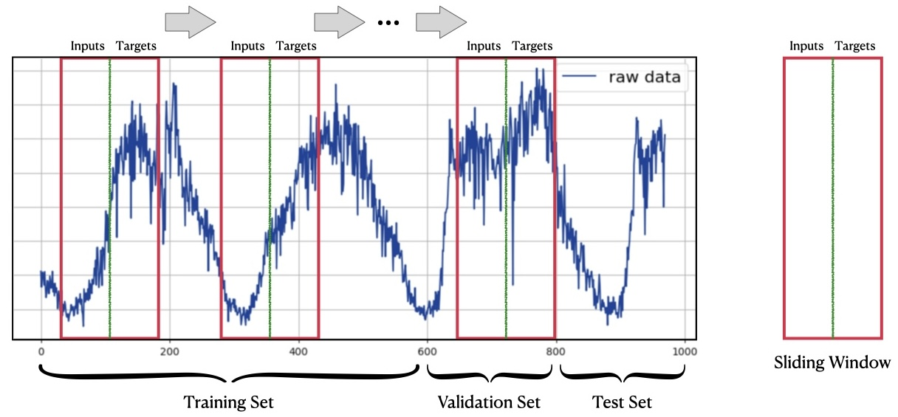

# 📦 数据集设计 (Dataset)

## ⏬ 数据下载

要开始使用数据集，请从 [Google Drive](https://drive.google.com/drive/folders/14EJVODCU48fGK0FkyeVom_9lETh80Yjp?usp=sharing) 或 [百度网盘](https://pan.baidu.com/s/1shA2scuMdZHlx6pj35Dl7A?pwd=s2xe) 下载 `all_data.zip` 文件。下载后，将文件解压至 `datasets/` 目录：

```bash
cd /path/to/BasicTS
unzip /path/to/all_data.zip -d datasets/
mv datasets/all_data/* datasets/
rmdir datasets/all_data
```

这些数据集已经过预处理，可以直接使用。

## 💿 数据格式

每个数据集至少包含两个基本文件：`data.dat` 和 `desc.json`：

- **`data.dat`**: 该文件以 `numpy.memmap` 格式存储原始时间序列数据，形状为 [L, N, C]。
    - **L**: 时间步数，训练集、验证集和测试集通常沿该维度划分。
    - **N**: 时间序列数量，也称为节点数量。
    - **C**: 特征数量，通常包括 [目标特征、时间（如日、周、月、年）]，其中目标特征是必须的，其他是可选的。
  
- **`desc.json`**: 该文件包含数据集的元数据，包括：
    - 数据集名称
    - 数据集所属领域
    - 数据形状
    - 时间切片数量
    - 节点数量（即时间序列数量）
    - 特征描述
    - 是否存在先验图结构
    - 常规设置：
        - 输入和输出长度
        - 训练集、验证集和测试集的比例
        - 是否对每个通道（即时间序列）单独归一化
        - 评估时是否重新归一化
        - 评估指标
        - 异常值处理方式

## 🧑‍💻 数据集类设计

<div align="center">
  
</div>

在时间序列预测中，数据集通常通过滑动窗口方法从原始时间序列数据中生成。正如上图所示，原始时间序列沿时间维度划分为训练集、验证集和测试集，样本通过大小为 `inputs + targets` 的滑动窗口生成。大多数数据集遵循这种结构。

BasicTS 提供了一个内置的 `Dataset` 类，称为 [`TimeSeriesForecastingDataset`](../basicts/data/simple_tsf_dataset.py)，专门用于时间序列数据。该类以字典形式生成样本，包含两个对象：`inputs` 和 `target`。`inputs` 表示输入数据，`target` 表示目标数据。详细的文档可以在类的注释中找到。

## 🧑‍🍳 如何添加或自定义数据集

如果您的数据集遵循上述结构，您可以将数据预处理为 `data.dat` 和 `desc.json` 格式，并将其放置在 `datasets/` 目录中，例如 `datasets/YOUR_DATA/{data.dat, desc.json}`。BasicTS 将自动识别并使用您的数据集。

参考资料可以查看 `scripts/data_preparation/` 中的脚本，这些脚本用于处理来自 `raw_data.zip` 的数据集（[Google Drive](https://drive.google.com/drive/folders/14EJVODCU48fGK0FkyeVom_9lETh80Yjp?usp=sharing)，[百度网盘](https://pan.baidu.com/s/1shA2scuMdZHlx6pj35Dl7A?pwd=s2xe)）。

如果您的数据集不符合标准格式或有特殊要求，您可以通过继承 `torch.utils.data.Dataset` 来定义自己的数据集类。在该自定义类中，`__getitem__` 方法应返回包含 `inputs` 和 `target` 的字典。

## 🧑‍💻 进一步探索

- **🎉 [快速上手](./getting_started_cn.md)**
- **💡 [了解 BasicTS 的设计理念](./overall_design_cn.md)**
- **📦 [探索数据集设计并自定义数据集](./dataset_design_cn.md)**
- **🛠️ [了解数据缩放器设计并创建自定义缩放器](./scaler_design_cn.md)**
- **🧠 [深入了解模型设计并构建自定义模型](./model_design_cn.md)**
- **📉 [了解评估指标设计并开发自定义损失函数与评估指标](./metrics_design_cn.md)**
- **🏃‍♂️ [掌握执行器设计并创建自定义执行器](./runner_design_cn.md)**
- **📜 [解析配置文件设计并自定义配置](./config_design_cn.md)**
- **🔍 [探索多种基线模型](../baselines/)**
