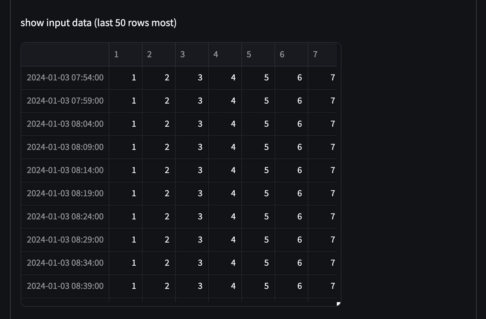
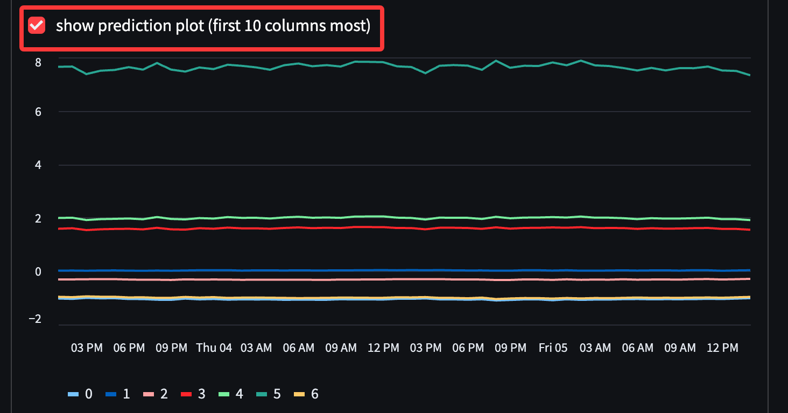

# Inference (Experimental)

This tutorial introduces inference procedures in BasicTS.

## 🗒 Inference Script

The inference script enables loading context data from a specified file, executing inference with a designated model, and saving predictions to an output file.

### Model Preparation

Before inference, train your model following the [Quick Start](https://github.com/GestaltCogTeam/BasicTS/blob/master/tutorial/getting_started.md) guide.

### Data Preparation

Context data must be:

- CSV format with UTF-8 encoding
- Comma-separated values
- First column: Timestamp in `Year-Month-Day Hour:Minute:Second` format
- Subsequent columns: Data values

**Example input:**

```csv
2024-01-01 00:00:00,1,2,3,4,5,6,7
2024-01-01 00:05:00,1,2,3,4,5,6,7
2024-01-01 00:10:00,1,2,3,4,5,6,7
...
```

### Execution

**Required parameters:**

- Configuration file path (`-cfg`)
- Model checkpoint path (`-ckpt`)
- Context data path (`-i`)
- Output data path (`-o`)
- GPU list (optional) (`-g`)

**For UTFS models (e.g., TimeMoe) add:**

- Context length (`-ctx`)
- Prediction length (`-pred`)

**Command structure:**
```bash
# Standard models
python experiments/inference.py -cfg <config_path> -ckpt <checkpoint_path> -i <context_path> -o <output_path>

# UTFS models
python experiments/inference.py -cfg <config_path> -ckpt <checkpoint_path> -i <context_path> -o <output_path> -ctx <context_length> -pred <prediction_length>
```

### Examples

1. **STID on ETTh1 dataset:**

```bash
python experiments/inference.py -cfg "baselines/STID/ETTh1.py" -ckpt "checkpoints/STID/ETTh1_100_336_336/587c21xxxx/STID_best_val_MAE.pt" -i "./in_etth1.csv" -o "out.csv"
```


**Output example:**

```csv
2024-01-03 13:00:00,-1.1436124,-0.0042671096,-0.35258546,1.7036028,2.1393495,8.280911,-1.0798432
2024-01-03 14:00:00,-1.1344103,-0.0021482962,-0.3535639,1.71777,2.1475496,8.356691,-1.0723352
...
```

2. **Chronos model:**

```bash
python experiments/inference.py -cfg "baselines/ChronosBolt/config/chronos_base.py" -ckpt "ckpts_release/ChronosBolt-base-BLAST.pt" -i "./in_etth1.csv" -o "out.csv" -ctx 72 -pred 36
```

**Output example:**

```csv
2024-01-03 12:05:00,1.0,2.0,3.0,4.0,5.0,6.0,7.0
2024-01-03 12:10:00,1.0,2.0,3.0,4.0,5.0,6.0,7.0
...
```

---

## 🌐 Web Interface

BasicTS provides a visual web interface for inference operations.

### Setup

1. Install dependencies:

```bash
pip install -r server/web_requirements.txt
```

2. Launch service:

```bash
streamlit run server/web_inference.py
```
If everything works, the page will be automatically opened in the browser.

You can also access via `http://host-ip-or-localhost:8501`.

### Workflow

#### Model Loading

- **Select configuration file**  

   
- **Choose checkpoint**  

  > [!NOTE]  
  > Checkpoint files must reside within the project directory.


   


- **Configure other parameters and load model**  
   

#### Loading Context Data

- **Upload context data:**  
  
- **Preview:**  
    
  

#### Inference Execution

- **Generate results:**  
  
- **Preview results:**  
    
  
- **Export in CSV format:**  
  

---

## 🖥 API Service

BasicTS provides an HTTP-based inference API.

> [!NOTE]  
> The API service is not optimized for high concurrency scenarios and should not be used directly in production.

### Setup

- **Install dependencies:**

```bash
pip install -r server/http_requirements.txt
```

- **Configure `server/http_server_config.py`:**

```python
class ServerConfig(BasicConfig):
    host: str = '0.0.0.0'
    port: int = 8502

class ModelConfig(BasicConfig):
    cfg_path: str = 'baselines/ChronosBolt/config/chronos_base.py' 
    ckpt_path: str = 'utsf_ckpt/ChronosBolt-base-BLAST.pt'
    device_type: str = 'gpu'
    gpus: Optional[str] = '0'
    context_length: int = 72
    prediction_length: int = 24
```

- **Start service:**

```bash
python server/http_server.py
```

### API Usage

- **Endpoint:** `http://host-ip:8501/inference`
- **Method:** PUT
- **Content-Type:** application/json

**Request:**

```json
{
  "data": 
  [
    ["2024-01-01 00:00:00",1,2,3,4,5,6,7],
    ["2024-01-01 00:05:00",1,2,3,4,5,6,7],
    ...
    ["2024-01-03 11:55:00",1,2,3,4,5,6,7],
    ["2024-01-03 12:00:00",1,2,3,4,5,6,7]
  ]
}
```

**Response:**

```json
{
  "result":
  [
    ["2024-01-03 12:05:00",1,2,3,4,5,6,7],
    ["2024-01-03 12:10:00",1,2,3,4,5,6,7],
    ...
    ["2024-01-03 13:55:00",1,2,3,4,5,6,7],
    ["2024-01-03 14:00:00",1,2,3,4,5,6,7]
  ]
}
```

**CURL Example:**

```bash
curl -X 'PUT' \
  'http://host-ip:8502/inference' \
  -H 'accept: application/json' \
  -H 'Content-Type: application/json' \
  -d '{
  "data": [
    ["2024-01-01 00:00:00",1,2,3,4,5,6,7],
    ["2024-01-01 00:05:00",1,2,3,4,5,6,7],
    ["2024-01-01 00:10:00",1,2,3,4,5,6,7],
    ......
    ["2024-01-03 11:55:00",1,2,3,4,5,6,7],
    ["2024-01-03 12:00:00",1,2,3,4,5,6,7]
  ]
}'
```

---

## 🧑‍💻 Explore Further

This tutorial has equipped you with the fundamentals to get started with BasicTS, but there’s much more to discover. Before delving into advanced topics, let’s take a closer look at the structure of BasicTS:

<div align="center">
  
</div>

The core components of BasicTS include `Dataset`, `Scaler`, `Model`, `Metrics`, `Runner`, and `Config`. To streamline the debugging process, BasicTS operates as a localized framework, meaning all the code runs directly on your machine. There’s no need to pip install basicts; simply clone the repository, and you’re ready to run the code locally.

Below are some advanced topics and additional features to help you maximize the potential of BasicTS:

- **🎉 [Getting Stared](./getting_started.md)**
- **💡 [Understanding the Overall Design Convention of BasicTS](./overall_design.md)**
- **📦 [Exploring the Dataset Convention and Customizing Your Own Dataset](./dataset_design.md)**
- **🛠️ [Navigating The Scaler Convention and Designing Your Own Scaler](./scaler_design.md)**
- **🧠 [Diving into the Model Convention and Creating Your Own Model](./model_design.md)**
- **📉 [Examining the Metrics Convention and Developing Your Own Loss & Metrics](./metrics_design.md)**
- **🏃‍♂️ [Mastering The Runner Convention and Building Your Own Runner](./runner_design.md)**
- **📜 [Interpreting the Config File Convention and Customizing Your Configuration](./config_design.md)**
- **🔍 [Exploring a Variety of Baseline Models](../baselines/)**
