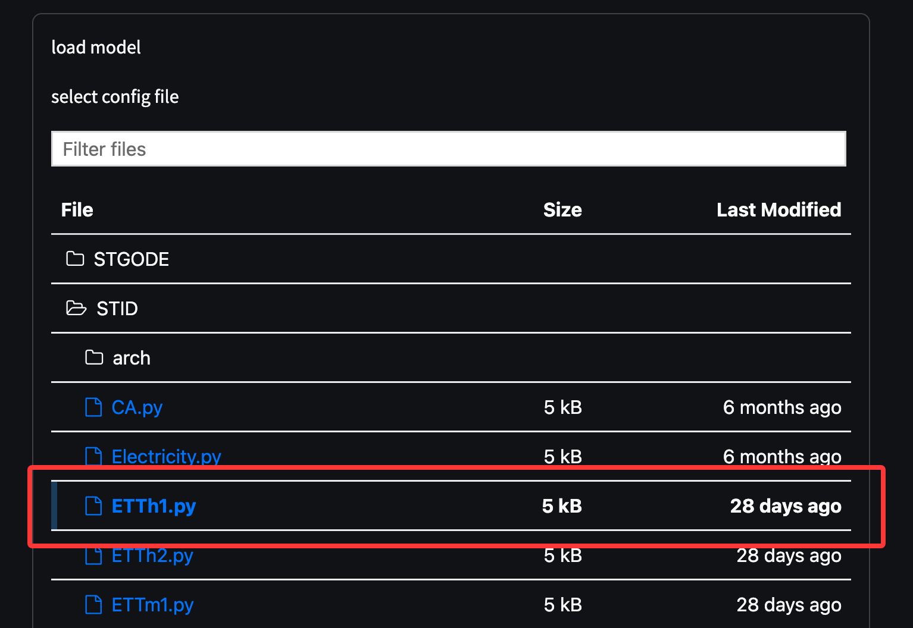
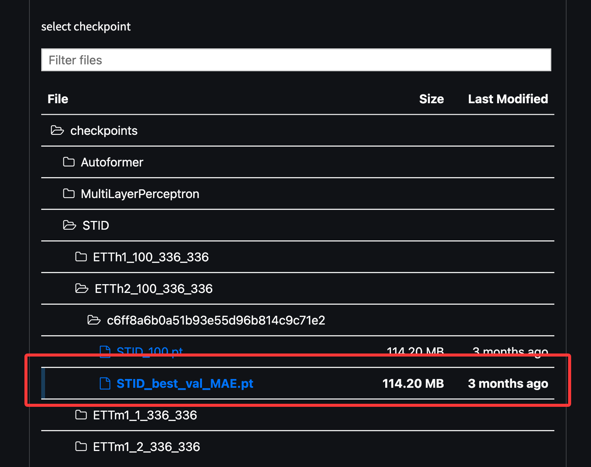
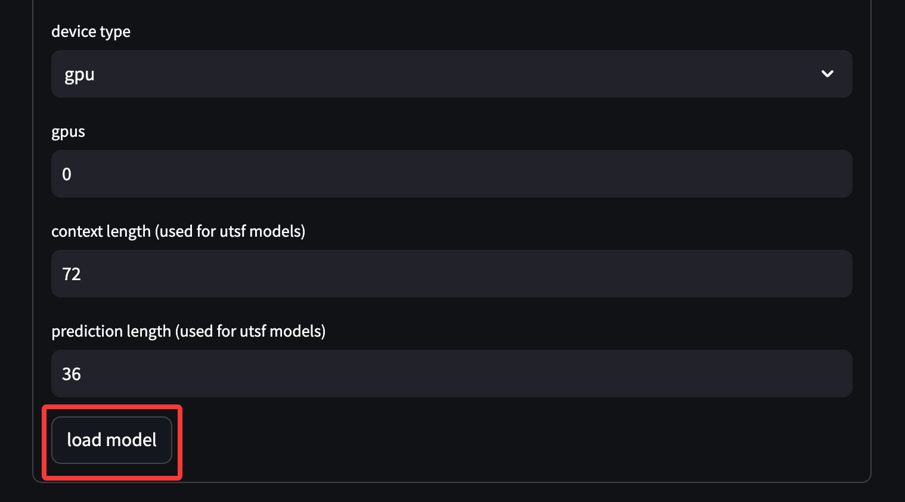
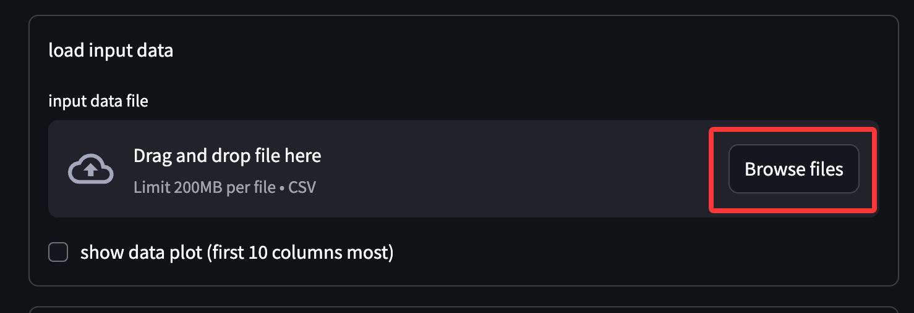
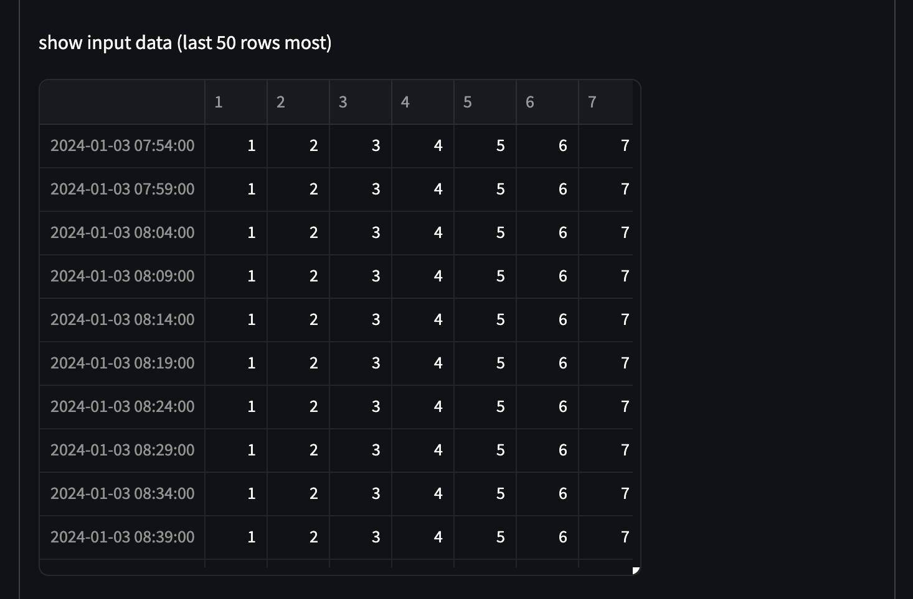
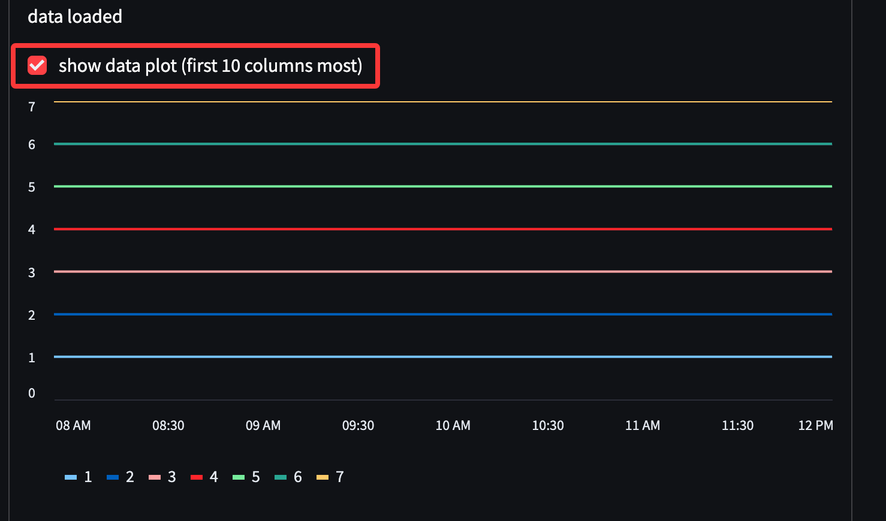
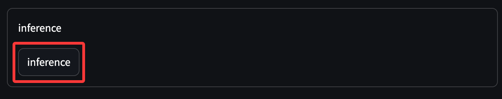
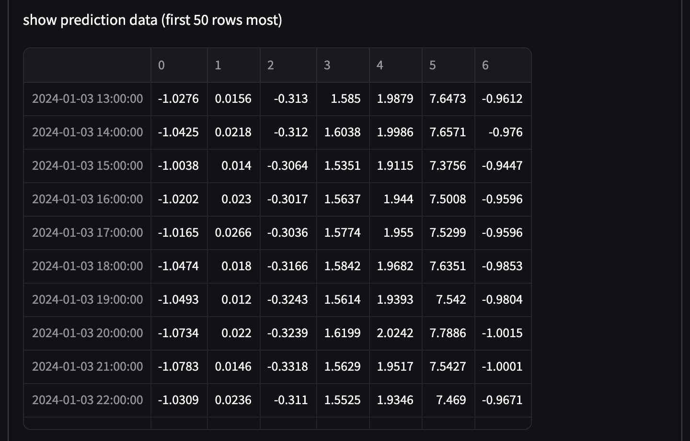
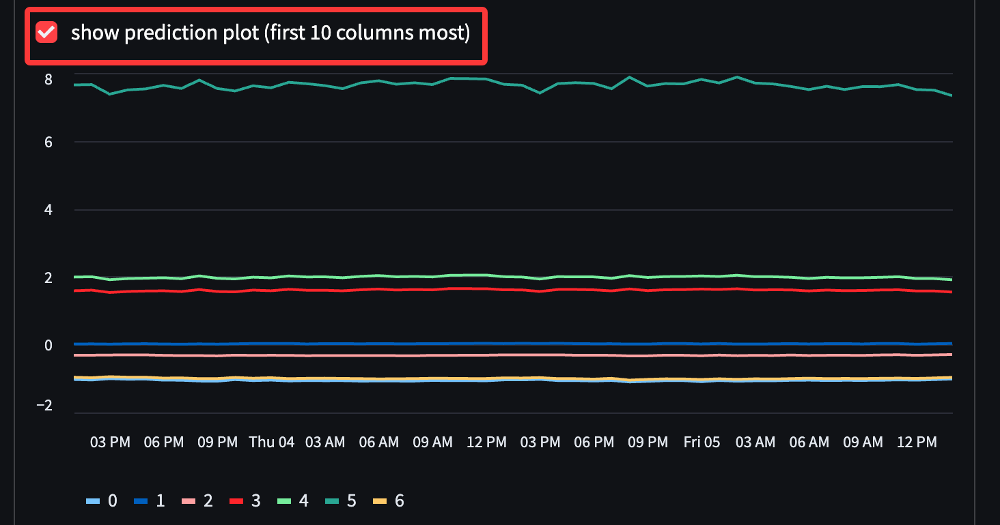
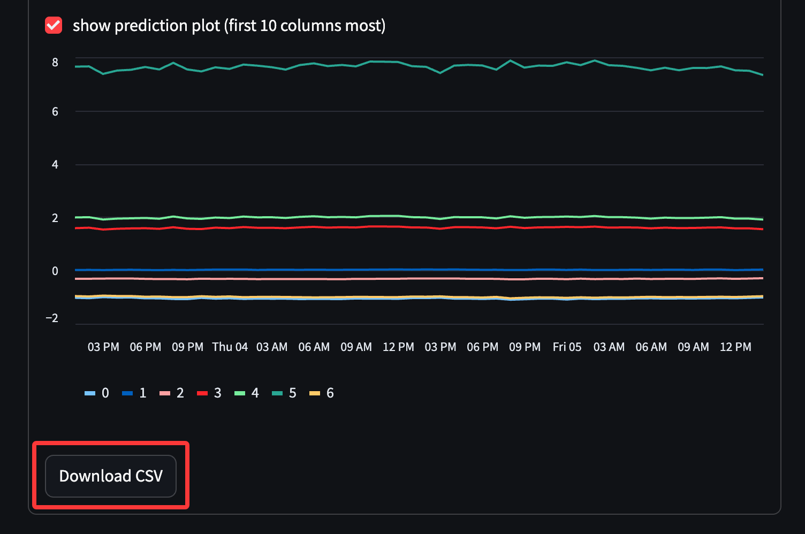

# 推理功能（实验性质）

本教程介绍如何使用BasicTS应用模型的推理能力.

## 🗒 推理脚本

使用推理脚本，可以从指定文件中读取输入数据，使用指定模型推理，并将输出结果保存在文件中。

### 模型准备

使用推理功能前，需要有一个已经训练好的模型。模型训练可以参考[快速上手](https://github.com/GestaltCogTeam/BasicTS/blob/master/tutorial/getting_started_cn.md)中的模型训练部分。

### 数据准备

- 输入数据采用csv格式
- UTF-8编码
- 使用逗号分隔
- 数据第一列为时间，格式为`年-月-日 小时:分钟:秒`
- 数据后续列依次为数据列。

以下是一个输入数据的示例：
```csv
2024-01-01 00:00:00,1,2,3,4,5,6,7
2024-01-01 00:05:00,1,2,3,4,5,6,7
2024-01-01 00:10:00,1,2,3,4,5,6,7
...
```

### 使用脚本推理

使用推理脚本需要准备以下几个参数：

- **模型检查点路径**
- **配置文件路径**
- **输入数据路径**
- **输出数据路径**
- **可用的GPU列表**（可选）

如果你使用utsf模型（如TimeMoe）进行推理，还需要额外提供：

- **模型输入长度**
- **模型输出长度**

推理脚本保存在`experiments/inference.py`，使用如下命令启动：

```bash
python experiments/inference.py -cfg <配置文件路径> -ckpt <检查点路径> -i <输入文件路径> -o <输出文件路径>
```

对于utsf模型，还需提供输入长度和输出长度

```bash
python experiments/inference.py -cfg <配置文件路径> -ckpt <检查点路径> -i <输入文件路径> -o <输出文件路径> -ctx <输出长度> -pred <输出长度>
```

### 示例

- **使用STID在ETTh1数据集设置下执行推理**

```bash
python experiments/inference.py -cfg "baselines/STID/ETTh1.py" -ckpt "/checkpoints/STID/ETTh1_100_336_336/587c21xxxx/STID_best_val_MAE.pt" -i "./in_etth1.csv" -o "out.csv"
```

输入数据集
```csv
2024-01-01 00:00:00,1,2,3,4,5,6,7
2024-01-01 00:05:00,1,2,3,4,5,6,7
2024-01-01 00:10:00,1,2,3,4,5,6,7
2024-01-01 00:15:00,1,2,3,4,5,6,7
2024-01-01 00:20:00,1,2,3,4,5,6,7
2024-01-01 00:25:00,1,2,3,4,5,6,7
...
```

输出结果
```csv
2024-01-03 13:00:00,-1.1436124,-0.0042671096,-0.35258546,1.7036028,2.1393495,8.280911,-1.0798432
2024-01-03 14:00:00,-1.1344103,-0.0021482962,-0.3535639,1.71777,2.1475496,8.356691,-1.0723352
...
```

- **使用chronos进行推理**

```bash
python experiments/inference.py -cfg "baselines/ChronosBolt/config/chronos_base.py" -ckpt "ckpts_release/ChronosBolt-base-BLAST.pt" -i "./in_etth1.csv" -o "out.csv" -ctx 72 -pred 36
```

输入数据集
```csv
2024-01-01 00:00:00,1,2,3,4,5,6,7
2024-01-01 00:05:00,1,2,3,4,5,6,7
2024-01-01 00:10:00,1,2,3,4,5,6,7
2024-01-01 00:15:00,1,2,3,4,5,6,7
2024-01-01 00:20:00,1,2,3,4,5,6,7
2024-01-01 00:25:00,1,2,3,4,5,6,7
...
```

输出结果
```csv
2024-01-03 12:05:00,1.0,2.0,3.0,4.0,5.0,6.0,7.0
2024-01-03 12:10:00,1.0,2.0,3.0,4.0,5.0,6.0,7.0
2024-01-03 12:15:00,1.0,2.0,3.0,4.0,5.0,6.0,7.0
2024-01-03 12:20:00,1.0,2.0,3.0,4.0,5.0,6.0,7.0
2024-01-03 12:25:00,1.0,2.0,3.0,4.0,5.0,6.0,7.0
...
```

---

## 🌐 Web页面

BasicTS推理功能可以通过可视化页面进行操作。

### 运行

1. **安装依赖**

```bash
pip install -r server/web_requirements.txt
```

2. **启动服务**

```bash
streamlit run server/web_inference.py
```

一切正常的话，浏览器会自动打开页面。
你也可以手动打开`http://host-ip-or-localhost:8501`浏览页面。

### 使用

#### 加载模型

- **选择配置文件**
  

- **选择对应的检查点**

  > [!NOTE]  
  > checkpoint文件需要在项目目录下
  


- **选择设备类型和其他参数**
  

#### 加载输入数据

- **上传输入数据**


- **支持以图表形式预览数据**




#### 执行推理

- **点击推理按钮生成结果**


- **支持以图表形式预览数据**



- **支持csv格式下载数据**


---

## 🖥 API服务

提供基于HTTP的推理API服务。
> [!NOTE]  
> API服务未对高并发场景优化，不要直接用于生产环境


### 运行

1. **安装依赖**

```bash
pip install -r server/http_requirements.txt
```

2. **编辑API服务配置**

编辑`server/http_server_config.py`文件，修改其中的模型和API服务参数。

```python
class ServerConfig(BasicConfig):
    host: str = '0.0.0.0'
    port: int = 8502

class ModelConfig(BasicConfig):
    cfg_path: str = 'baselines/ChronosBolt/config/chronos_base.py' 
    ckpt_path: str = 'utsf_ckpt/ChronosBolt-base-BLAST.pt'
    device_type: str = 'gpu'
    gpus: Optional[str] = '0'
    context_length: int = 72
    prediction_length: int = 24
    
```

3. **启动服务** 

```bash
python server/http_server.py
```

### 使用

- **接口地址：**http://host-ip:8501/inference
- **请求方式：**PUT
- **请求类型：**JSON
- **输入参数：**
```json
{
  "data": [
    ["2024-01-01 00:00:00",1,2,3,4,5,6,7],
    ["2024-01-01 00:05:00",1,2,3,4,5,6,7],
    ...
    ["2024-01-03 11:55:00",1,2,3,4,5,6,7],
    ["2024-01-03 12:00:00",1,2,3,4,5,6,7]
  ]
}
```
- **输出结果：**
```json
{
  "result":
  [
    ["2024-01-03 12:05:00",1,2,3,4,5,6,7],
    ["2024-01-03 12:10:00",1,2,3,4,5,6,7],
    ...
    ["2024-01-03 13:55:00",1,2,3,4,5,6,7],
    ["2024-01-03 14:00:00",1,2,3,4,5,6,7]
  ]
}
```
- **CURL示例**
```bash
curl -X 'PUT' \
  'http://host-ip:8502/inference' \
  -H 'accept: application/json' \
  -H 'Content-Type: application/json' \
  -d '{
  "data": [
    ["2024-01-01 00:00:00",1,2,3,4,5,6,7],
    ["2024-01-01 00:05:00",1,2,3,4,5,6,7],
    ["2024-01-01 00:10:00",1,2,3,4,5,6,7],
    ......
    ["2024-01-03 11:55:00",1,2,3,4,5,6,7],
    ["2024-01-03 12:00:00",1,2,3,4,5,6,7]
  ]
}'
```

## 🧑‍💻 进一步探索

本教程为您提供了 BasicTS 的基础知识，但还有更多内容等待您探索。在深入其他主题之前，我们先更详细地了解 BasicTS 的结构：

<div align="center">
  
</div>

BasicTS 的核心组件包括 `Dataset`、`Scaler`、`Model`、`Metrics`、`Runner` 和 `Config`。为简化调试过程，BasicTS 作为一个本地化框架运行，所有代码都直接在您的机器上运行。无需 `pip install basicts`，只需克隆仓库，即可本地运行代码。

以下是一些高级主题和附加功能，帮助您充分利用 BasicTS：

- **🎉 [快速上手](./getting_started_cn.md)**
- **💡 [了解 BasicTS 的设计理念](./overall_design_cn.md)**
- **📦 [探索数据集设计并自定义数据集](./dataset_design_cn.md)**
- **🛠️ [了解数据缩放器设计并创建自定义缩放器](./scaler_design_cn.md)**
- **🧠 [深入了解模型设计并构建自定义模型](./model_design_cn.md)**
- **📉 [了解评估指标设计并开发自定义损失函数与评估指标](./metrics_design_cn.md)**
- **🏃‍♂️ [掌握执行器设计并创建自定义执行器](./runner_design_cn.md)**
- **📜 [解析配置文件设计并自定义配置](./config_design_cn.md)**
- **🔍 [探索多种基线模型](../baselines/)**
