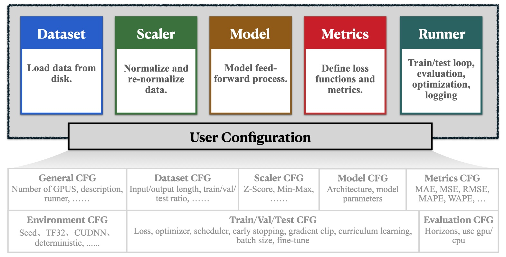

# 💡 The Overall Design of BasicTS

  

In a time series forecasting pipeline, the following key components are typically involved:

- **Dataset**: Specifies the methods for reading datasets and generating samples. (Located in `basicts.data`)
- **Scaler**: Manages the normalization and denormalization of datasets, supporting techniques such as Z-score and Min-Max normalization. (Located in `basicts.scaler`)
- **Metrics**: Defines the evaluation metrics and loss functions, including MAE, MSE, MAPE, RMSE, and WAPE. (Located in `basicts.metrics`)
- **Runner**: The core module of BasicTS, responsible for orchestrating the entire training process. The Runner integrates components such as Dataset, Scaler, Model, and Metrics, and provides a wide range of features including multi-GPU training, distributed training, persistent logging, model auto-saving, curriculum learning, and gradient clipping. (Located in `basicts.runner`)
- **Model**: Defines the model architecture and the forward propagation process.

BasicTS includes a comprehensive and extensible set of components, enabling users to complete most tasks simply by providing a model structure.

To streamline the configuration of training strategies and centralize all options for easy and fair comparisons, BasicTS follows an **config-driven** design philosophy.

Users can easily configure models, datasets, scaling methods, evaluation metrics, optimizers, learning rates, and other hyperparameters by modifying the configuration file—**as simple as filling out a form**.

For example, setting `CFG.TRAIN.EARLY_STOPPING_PATIENCE = 10` enables early stopping with a patience level of 10.

## 🧑‍💻 Explore Further

- **🎉 [Getting Stared](./getting_started.md)**
- **💡 [Understanding the Overall Design Convention of BasicTS](./overall_design.md)**
- **📦 [Exploring the Dataset Convention and Customizing Your Own Dataset](./dataset_design.md)**
- **🛠️ [Navigating The Scaler Convention and Designing Your Own Scaler](./scaler_design.md)**
- **🧠 [Diving into the Model Convention and Creating Your Own Model](./model_design.md)**
- **📉 [Examining the Metrics Convention and Developing Your Own Loss & Metrics](./metrics_design.md)**
- **🏃‍♂️ [Mastering The Runner Convention and Building Your Own Runner](./runner_design.md)**
- **📜 [Interpreting the Config File Convention and Customizing Your Configuration](./config_design.md)**
- **🔍 [Exploring a Variety of Baseline Models](../baselines/)**
