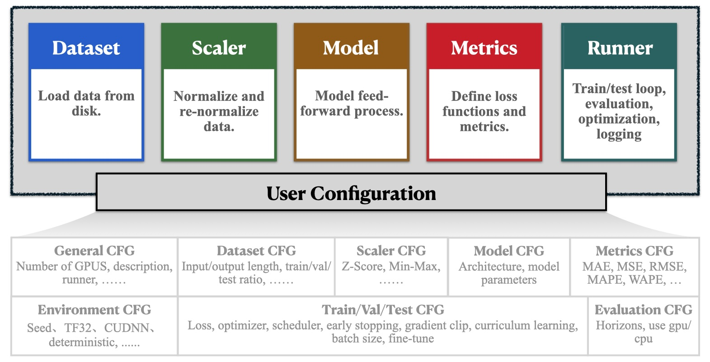

# 💡 BasicTS 的整体设计

  

在时间序列预测流程中，通常包含以下几个关键部分：

- **数据集 (Dataset)**：定义读取数据集和生成样本的方式。（位于 `basicts.data`）
- **数据缩放 (Scaler)**：处理数据的归一化与反归一化操作，如 Z-score 和 Min-Max 归一化等方法。（位于 `basicts.scaler`）
- **评估指标 (Metrics)**：定义模型评估的指标和损失函数，包括 MAE、MSE、MAPE、RMSE 和 WAPE 等。（位于 `basicts.metrics`）
- **执行器 (Runner)**：作为 BasicTS 的核心模块，负责协调整个训练过程。执行器集成了数据集、数据缩放、模型架构和评估指标等组件，提供了多种功能支持，如多 GPU 训练、分布式训练、日志记录、模型自动保存、课程学习、梯度裁剪等。（位于 `basicts.runner`）
- **模型结构 (Model)**：定义模型架构及其前向传播过程。

BasicTS 提供了完整且可扩展的组件，用户只需提供模型结构，即可完成大部分任务。

为了简化训练策略配置并方便对比，BasicTS 遵循 **一切基于配置** 的设计理念：所有选项都集成在配置文件中，用户只需修改配置文件即可轻松设置模型、数据集、归一化方法、评估指标、优化器、学习率和其他超参数——**像填写表单一样简单**。
例如，通过设置 `CFG.TRAIN.EARLY_STOPPING_PATIENCE = 10` 就可以启用提前停止机制，并设置耐心值为 10。

## 🧑‍💻 进一步探索

- **🎉 [快速上手](./getting_started_cn.md)**
- **💡 [了解 BasicTS 的设计理念](./overall_design_cn.md)**
- **📦 [探索数据集设计并自定义数据集](./dataset_design_cn.md)**
- **🛠️ [了解数据缩放器设计并创建自定义缩放器](./scaler_design_cn.md)**
- **🧠 [深入了解模型设计并构建自定义模型](./model_design_cn.md)**
- **📉 [了解评估指标设计并开发自定义损失函数与评估指标](./metrics_design_cn.md)**
- **🏃‍♂️ [掌握执行器设计并创建自定义执行器](./runner_design_cn.md)**
- **📜 [解析配置文件设计并自定义配置](./config_design_cn.md)**
- **🔍 [探索多种基线模型](../baselines/)**
